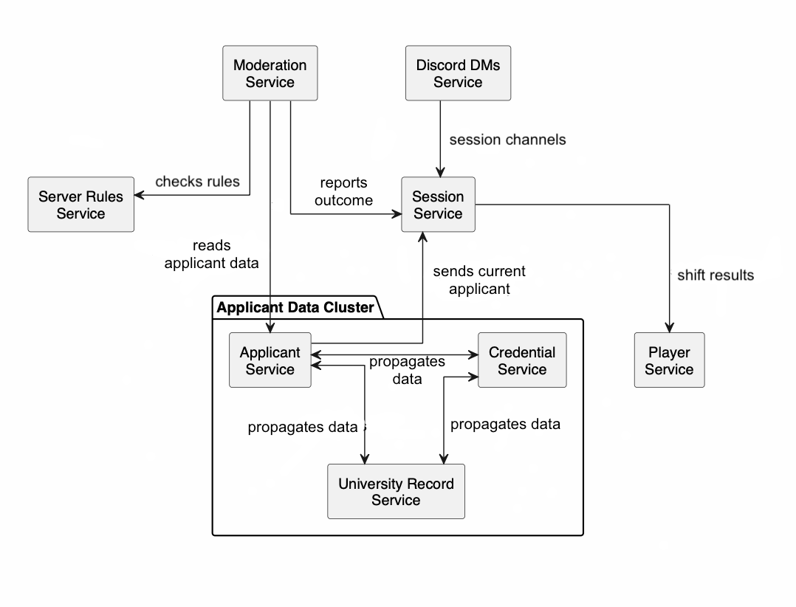

# Student ID, please

A game set in a university Discord server where a moderation team decides who gets access, based on credentials and information that may or may not be true. Each round an applicant arrives at the door: a student, an alumnus, a staff member or an outsider, presenting documents that may be forged, expired or simply someone else's. One player acts as Moderator and makes the call; the rest are Junior Moderators who each hold a different slice of the university's records and have to piece the truth together over chat before the Moderator decides.

## Contents

- [Service Boundaries](#service-boundaries)
- [Architecture Diagram](#architecture-diagram)
- [Technologies and Communication Patterns](#technologies-and-communication-patterns)
- [Communication Contract](#communication-contract)
- [GitHub Workflow](#github-workflow)
- [Project Board](#project-board)

## Service Boundaries

The system is split into 8 microservices, each encapsulating one specific piece of functionality.

### 1. Player Service
Responsible for the identity of the players. Stores accounts, authentication, profiles, friends and XP/Levels. Tracks persistent player progression through leveling, based on moderator experience, completed shifts and disciplinary actions.

It holds nothing about the people attempting to join the server.

### 2. Server Moderation Session Service
Manages an active Discord moderation session. A session represents one moderation shift and contains a Moderator and several Junior Moderator players. Handles creating and joining sessions, assigning roles, starting/ending shifts, the current applicant, number of applications processed, and session score and penalties.

It is also the authority on role to access mapping: which Junior Moderator was assigned which records and which chat channels.

### 3. Applicant Service
Owns the people attempting to access the server. Generates applicants with information such as name, student ID, major, year, university status, courses and role, covering FAF students, students from other majors, teaching assistants, university staff, alumni and outsiders. Some applicants are generated with false information or as impersonation attempts.

It owns what the applicant *claims*, not whether the claim is true.

### 4. Credential Service
Owns the documents and credentials presented by applicants, such as student ID, university email, enrollment confirmation and course registration. Validates the structure and authenticity of credentials, which can be expired, forged, inconsistent or incomplete.

It decides whether a document is sound, never whether the applicant should be admitted.

### 5. Server Rules Service
Owns the current rules for accessing the Discord server. Rules can change between shifts and grow increasingly complex. Evaluates applicants against the current access rules.

It stores no applicant data of its own; it is handed what it needs per request and returns a verdict.

### 6. University Record Service
Provides the hidden university information moderators may need to verify an applicant, such as enrollment lists, email group lists, existing courses, academic year, semester schedule and server message records. This information is deliberately distributed among junior mod players, and the service enforces that a player cannot read a record type they were not assigned.

### 7. Moderation Service
Owns the admission decision for each applicant. The Moderator can Accept, Reject, Flag or Ban an applicant. Determines whether a decision was correct according to the current server rules, and records the applicant, decision, violated rules, penalties and outcome.

### 8. Discord DMs Service
Provides real-time communication between the moderator and the junior mods, over a Discord-like WebSocket interface. Manages channels tied to the current moderation session, with different players having access to different channels.

It transports messages and never judges whether what is said is correct.

## Architecture Diagram



### Service Relationships

Arrows point from the service that initiates a call to the service it calls. The
diagram uses three arrow styles, matching the three transports defined below:
**solid** = synchronous REST, **dashed** = asynchronous event (RabbitMQ),
**double** = WebSocket surface. If the rendered PNG does not yet show all three
styles, this text is the source of truth until the image is regenerated.

Server Moderation Session Service runs the shift: it validates players on join
(REST → Player), requests the next applicant (REST → Applicant), publishes shift
results to Player (event), and answers the access checks from University Record
Service and Discord DMs Service (REST), since it owns the role to access mapping.
It does not gather applicant data itself.

Moderation Service does that instead. It fetches ground truth from University
Record Service (REST) and the current rule set from Server Rules Service, has the
decision evaluated there (REST), and reports the outcome back to the session as an
event so score and penalties update.

Applicant Service is the fixed entry point for new applicants, propagating each
one to Credential Service and University Record Service as an event
(`ApplicantSeed`). The spec allows any of the three to be contacted first; we
fixed Applicant Service as the entry point for implementation simplicity, so the
other two never talk to each other.

Player Service sits at the edge and only ever hears from Session Service. Discord
DMs Service only transports messages, and never talks to Moderation Service.

## Technologies and Communication Patterns

We work in two languages, split by the nature of the work rather than by
person: the services that coordinate the game and push real-time updates are
written in **TypeScript (NestJS)**, and the services that generate, store and
validate data are written in **PHP (Laravel)**.

TypeScript/NestJS earns its place on the real-time and orchestration cluster.
NestJS ships WebSocket gateways and a built-in microservice/event transport, so
the two real-time surfaces (moderator chat, live session state) and the event
fan-out come from the framework instead of being bolted on. Its type system
also keeps the heavily typed contract below honest at compile time.

PHP/Laravel earns its place on the data cluster. These services are mostly CRUD
and payload validation — generate a coherent (and often deliberately
inconsistent) applicant, store records, check a document against a schema — and
Eloquent together with Laravel's form-request validation cover exactly that with
little ceremony. It is also the stack the team is fastest in, which matters
under a weekly lab cadence: a working, well-understood service beats a
marginally lighter one we have to fight. The trade-off is that Laravel is a
heavier runtime than a PHP microframework, and PHP is weaker at long-lived
real-time and async work than Node — which is precisely why the real-time and
orchestration cluster is TypeScript, not PHP. Where these services consume
events, they do so through a long-running worker (php-amqplib), not inside the
request cycle.

Every service owns its own PostgreSQL database. No service reads another's
tables; the only route to another service's data is through its endpoints or
its events. This is deliberate — a shared database would let us skip the
contract, which is the one thing Lab 0 exists to force us to get right.

| Service | Language / Framework | Datastore | Talks via | Why |
|---|---|---|---|---|
| Player | PHP / Laravel | PostgreSQL | REST, consumes events | Relational identity data (friends, levels); pure CRUD |
| Session | TypeScript / NestJS | PostgreSQL | REST, WebSocket, events | Orchestrates the shift, pushes live state, owns role→access |
| Applicant | PHP / Laravel | PostgreSQL | REST, publishes events | Generates the applicant story, including the deception |
| Credential | PHP / Laravel | PostgreSQL | REST, consumes events | Document generation and structural validation |
| Server Rules | PHP / Laravel | PostgreSQL | REST | Rule storage and verdict evaluation |
| University Record | PHP / Laravel | PostgreSQL | REST, consumes events | Access-controlled ground-truth store |
| Moderation | TypeScript / NestJS | PostgreSQL | REST, publishes events | Decides and scores the admission, coordinating Rules + Records |
| Discord DMs | TypeScript / NestJS | PostgreSQL | WebSocket, REST | Real-time per-session chat |

Three communication patterns are in use, each where it fits:

- **Synchronous REST** is the default, for any call where the caller needs an
  answer before it can continue: validating a player on join, fetching ground
  truth, asking Server Rules for a verdict, running an access check against the
  session.
- **WebSockets** carry the two real-time surfaces: the moderator / junior-mod
  chat in Discord DMs, and the live session state (current applicant, score)
  pushed by Session.
- **Asynchronous events** (RabbitMQ) carry the three fire-and-forget paths where
  the sender does not wait for the receiver: Applicant propagating a new
  applicant to Credential and University Record, Moderation reporting a recorded
  decision back to Session, and Session publishing shift results to Player.

---

## Communication Contract

### Conventions

**Auth.** Player Service issues a JWT on login carrying `playerId`. That token is
enough for player-scoped calls (profile, friends, teams). Session context is
added when a player enters a session: `POST /sessions` (for the moderator) and
`POST /sessions/{id}/join` (for junior mods) return a short-lived **session
token** that additionally carries `sessionId` and `role`. Session-scoped calls —
access checks, record reads, channel reads, decisions, and the two WebSocket
handshakes — carry the session token. Every REST call except `POST /auth/*`
carries `Authorization: Bearer <token>`; services validate it locally against a
shared public key and read `playerId`, and where present `sessionId` and `role`,
from the claims, with no round-trip back to Player Service.

**Types.** `UUID` = RFC-4122 string. `timestamp` = ISO-8601 UTC. `enum(...)` =
closed string set. All bodies are `application/json`.

**Error envelope.**

```json
{ "error": "APPLICANT_NOT_FOUND", "message": "human readable", "details": {} }
```

Common statuses: `400` bad payload, `401` no/invalid token, `403` record or
channel access denied, `404` missing, `409` conflict/idempotency, `422`
validation.

**Event envelope.** Async events travel through RabbitMQ as:

```json
{ "eventId": "UUID", "type": "ApplicantSeed",
  "occurredAt": "timestamp", "sessionId": "UUID", "payload": {} }
```

Consumers are idempotent on `eventId` and on the domain key (`applicantId`,
`decisionId`), so a redelivery never applies twice.

**Transport legend.** Each endpoint is tagged `[REST]`, `[EVENT]` or `[WS]`.

### Data management and the applicant bootstrap

Each service keeps its own database and nothing is shared. The one flow that
spans services is creating an applicant, and we keep it simple: **Applicant
Service is the only entry point.** Session asks Applicant for the next
applicant; Applicant generates the whole coherent story and propagates a slice
to the other two. Credential and University Record only ever consume — they
never contact each other, and neither is ever "contacted first".

The story Applicant generates is one payload with three parts: what the
applicant *presents* at the door (which may be false), the *ground truth* in the
records, and the *deception* metadata linking them. Applicant emits it as
`ApplicantSeed`; Credential materializes the documents slice, University Record
materializes the ground-truth slice, both keyed by `applicantId` for
idempotency.

```json
// ApplicantSeed.payload
{
  "applicantId": "UUID",
  "sessionId": "UUID",
  "presented": {                       // what the applicant claims
    "name": "string", "studentId": "string", "major": "string", "year": "int",
    "role": "enum(student|other_major|ta|staff|alumni|outsider)",
    "universityStatus": "enum(enrolled|graduated|expelled|none)",
    "courses": ["string"]
  },
  "groundTruth": {                     // the real records (University Record owns)
    "exists": "bool", "realStudentId": "string|null", "realMajor": "string|null",
    "realYear": "int|null",
    "realStatus": "enum(enrolled|graduated|expelled|banned|none)",
    "enrolledCourses": ["string"], "email": "string|null",
    "previouslyBanned": "bool"
  },
  "documents": [                       // Credential owns
    { "type": "enum(student_id|university_email|enrollment_confirmation|else_registration)",
      "fields": {},
      "status": "enum(valid|expired|forged|inconsistent|incomplete)" }
  ],
  "deception": {
    "isImpostor": "bool",
    "strategy": "enum(none|forged_document|expired_document|identity_theft|wrong_major|banned_retry)",
    "mismatchedFields": ["string"]
  }
}
```

The correct decision is never in the seed. It is derived at decision time by
evaluating `groundTruth` against the current rules (see Moderation Service).

### Player Service

| Method & path | Request | Response |
|---|---|---|
| `POST /auth/register` `[REST]` | `{username, email, password}` | `201 {playerId, token}` |
| `POST /auth/login` `[REST]` | `{email, password}` | `200 {token, refreshToken, playerId}` |
| `POST /auth/refresh` `[REST]` | `{refreshToken}` | `200 {token}` |
| `GET /players/{id}` `[REST]` | — | `200 PlayerProfile` |
| `PATCH /players/{id}` `[REST]` | `{displayName?, avatar?}` | `200 PlayerProfile` |
| `GET /players/{id}/progression` `[REST]` | — | `200 {xp, level, completedShifts, disciplinaryActions}` |
| `GET /players/{id}/friends` `[REST]` | — | `200 [{playerId, username, status}]` |
| `POST /players/{id}/friends` `[REST]` | `{friendId}` | `201 {status:"pending"\|"accepted"}` |
| `DELETE /players/{id}/friends/{friendId}` `[REST]` | — | `204` |
| `POST /teams` `[REST]` | `{name, ownerId}` | `201 {teamId}` |
| `GET /teams/{id}` `[REST]` | — | `200 {teamId, name, ownerId, members[]}` |
| `POST /teams/{id}/members` `[REST]` | `{playerId}` | `201` |
| `DELETE /teams/{id}/members/{playerId}` `[REST]` | — | `204` |
| `GET /players/{id}/validate` `[REST]` | *(internal, Session)* | `200 {exists, level, teamId}` |

```json
// PlayerProfile
{ "playerId":"UUID", "username":"string", "email":"string",
  "level":"int", "xp":"int", "createdAt":"timestamp" }
```

**Consumes** `ShiftCompleted` → award XP, increment `completedShifts`, apply
`disciplinaryActions`.

### Server Moderation Session Service

| Method & path | Request | Response |
|---|---|---|
| `POST /sessions` `[REST]` | `{teamId, moderatorId}` | `201 {sessionId, status:"lobby", sessionToken}` |
| `POST /sessions/{id}/join` `[REST]` | `{playerId}` | `200 {role:"junior_mod", sessionToken}` |
| `POST /sessions/{id}/roles` `[REST]` | `{assignments:[RoleAssignment]}` | `200` |
| `POST /sessions/{id}/start` `[REST]` | — | `200 {status:"active", startedAt}` |
| `POST /sessions/{id}/next-applicant` `[REST]` | — | `202 {applicantId}` *(calls Applicant)* |
| `GET /sessions/{id}/current-applicant` `[REST]` | — | `200 {applicantId}` |
| `POST /sessions/{id}/end` `[REST]` | — | `200 SessionResult` *(emits ShiftCompleted)* |
| `GET /sessions/{id}` `[REST]` | — | `200 SessionState` |
| `GET /sessions/{id}/results` `[REST]` | — | `200 SessionResult` |
| `GET /sessions/{id}/access-check` `[REST]` | `?playerId=&recordType=&channel=` *(internal)* | `200 {allowed:bool}` |
| `WS /sessions/{id}/live` `[WS]` | — | server pushes state changes |

```json
// RoleAssignment — drives both record access and channel access
{ "playerId":"UUID", "role":"enum(moderator|junior_mod)",
  "recordAccess":["enum(enrollment|emails|courses|schedule|fcim)"],
  "channelAccess":["string"] }

// SessionState
{ "sessionId":"UUID", "status":"enum(lobby|active|ended)",
  "moderatorId":"UUID", "juniorMods":["UUID"],
  "currentApplicantId":"UUID|null",
  "applicationsProcessed":"int", "score":"int", "penalties":"int" }

// SessionResult
{ "sessionId":"UUID", "score":"int", "penalties":"int",
  "applicationsProcessed":"int", "correctDecisions":"int",
  "perPlayer":[{"playerId":"UUID","xpAwarded":"int","disciplinaryActions":"int"}] }
```

> **Two different "access" ideas — do not conflate them.** `RoleAssignment` here
> governs *which member of the moderation team may read which record or channel*
> — a moderator-side permission, enforced by `access-check`. It is unrelated to
> `allowedChannels` in a `RuleVerdict` (Server Rules), which is part of the
> *applicant's* outcome: which Discord channels that applicant would be allowed
> into if admitted. One is about the players at the desk; the other is about the
> person at the door.

`WS /sessions/{id}/live` pushes: `{type:"applicant_changed", applicantId}`,
`{type:"score_updated", score, penalties}`, `{type:"shift_ended", result}`.

**Consumes** `DecisionRecorded` → update score / penalties /
`applicationsProcessed`, advance current applicant.
**Publishes** `ShiftCompleted { sessionId, perPlayer[] }`.
Session is the authority on role→access; University Record and Discord DMs call
`access-check` before serving a record or a channel.

### Applicant Service

| Method & path | Request | Response |
|---|---|---|
| `POST /applicants` `[REST]` | `{sessionId}` | `201 {applicantId}` *(generates story, emits ApplicantSeed)* |
| `GET /applicants/{id}` `[REST]` | *(internal — includes impostor flag)* | `200 Applicant` |
| `GET /applicants/{id}/public` `[REST]` | — | `200 ApplicantPublic` *(what the moderator sees)* |
| `GET /applicants?sessionId=` `[REST]` | — | `200 [ApplicantPublic]` |

```json
// ApplicantPublic — presented info only, may be false by design
{ "applicantId":"UUID", "name":"string", "studentId":"string",
  "major":"string", "year":"int",
  "role":"enum(student|other_major|ta|staff|alumni|outsider)",
  "universityStatus":"enum(enrolled|graduated|expelled|none)",
  "courses":["string"] }

// Applicant — adds internal fields, never exposed to players
{ "...ApplicantPublic":"...", "isImpostor":"bool", "strategy":"string" }
```

**Publishes** `ApplicantSeed` on creation.

### Credential Service

| Method & path | Request | Response |
|---|---|---|
| `GET /applicants/{id}/credentials` `[REST]` | — | `200 [Credential]` |
| `GET /credentials/{id}` `[REST]` | — | `200 Credential` |
| `POST /credentials/{id}/validate` `[REST]` | — | `200 ValidationResult` |

```json
// Credential
{ "credentialId":"UUID", "applicantId":"UUID",
  "type":"enum(student_id|university_email|enrollment_confirmation|else_registration)",
  "fields":{},                        // type-specific, e.g. {studentId, issuedAt, expiresAt}
  "status":"enum(valid|expired|forged|inconsistent|incomplete)" }

// ValidationResult — structural / authenticity check only
{ "credentialId":"UUID", "structurallyValid":"bool", "authentic":"bool",
  "issues":["enum(expired|signature_mismatch|missing_field|field_conflict)"] }
```

**Consumes** `ApplicantSeed` → materialize the documents slice.

### Server Rules Service

| Method & path | Request | Response |
|---|---|---|
| `GET /rules/current?sessionId=` `[REST]` | — | `200 RuleSet` |
| `POST /rules` `[REST]` | `{sessionId, rules:[Rule]}` | `201 {ruleSetVersion}` |
| `GET /rules/{ruleSetVersion}` `[REST]` | — | `200 RuleSet` |
| `POST /rules/evaluate` `[REST]` | `{groundTruth, ruleSetVersion}` | `200 RuleVerdict` |

```json
// Rule
{ "id":"UUID",
  "predicate":"enum(is_faf|min_years_enrolled|not_previously_banned|role_allows_channel|is_enrolled)",
  "params":{},                        // e.g. {"minYears":2} or {"channel":"#groapa"}
  "effect":"enum(allow|deny|restrict_channels)" }

// RuleSet
{ "ruleSetVersion":"int", "sessionId":"UUID", "rules":["Rule"] }

// RuleVerdict — the ground-truth "correct answer"
{ "verdict":"enum(accept|reject|flag|ban)",
  "allowedChannels":["string"],
  "violations":[{"ruleId":"UUID","predicate":"string"}] }
```

### University Record Service

Reads split into two kinds. **Per-applicant** records (`enrollment`, `emails`,
`schedule`, `fcim-messages`) are keyed by `applicantId` and access-controlled:
every read carries the caller's `playerId` (from the session token), the service
calls Session's `access-check`, and if that player was not assigned the requested
record type it returns `403`. **Reference** records are session-global:
`courses` is the current course catalog — still gated by the `courses`
assignment, but not applicant-specific — and `academic-year` is open reference
data that needs no assignment and is never `403`.

| Method & path | Request | Response |
|---|---|---|
| `GET /records/enrollment?applicantId=` `[REST]` | — | `200 {enrolled, studentId, major, year, status}` \| `403` |
| `GET /records/emails?applicantId=` `[REST]` | — | `200 {email, inGroupList}` \| `403` |
| `GET /records/courses` `[REST]` | *(global, gated by `courses` assignment)* | `200 {courses:[string]}` \| `403` |
| `GET /records/academic-year` `[REST]` | *(global, open reference)* | `200 {year, semester:enum(autumn\|spring)}` |
| `GET /records/schedule?applicantId=` `[REST]` | — | `200 {entries:[{course, day, time}]}` \| `403` |
| `GET /records/fcim-messages?applicantId=` `[REST]` | — | `200 {messages:[{author, text, ts}]}` \| `403` |
| `GET /records/ground-truth/{applicantId}` `[REST]` | *(internal, Moderation only)* | `200 groundTruth` |

**Consumes** `ApplicantSeed` → materialize the ground-truth slice.

### Moderation Service

On `POST /decisions` the service (1) fetches `groundTruth` from University
Record, (2) reads the current `ruleSetVersion` from Server Rules
(`GET /rules/current?sessionId=`), (3) calls `POST /rules/evaluate` with
`{groundTruth, ruleSetVersion}` for the correct verdict, (4) compares the
moderator's `action` against it, (5) records the result, (6) emits
`DecisionRecorded`.

| Method & path | Request | Response |
|---|---|---|
| `POST /decisions` `[REST]` | `{sessionId, applicantId, moderatorId, action:enum(accept\|reject\|flag\|ban)}` | `201 Decision` |
| `GET /decisions/{id}` `[REST]` | — | `200 Decision` |
| `GET /sessions/{id}/decisions` `[REST]` | — | `200 [Decision]` |

```json
// Decision
{ "decisionId":"UUID", "sessionId":"UUID", "applicantId":"UUID",
  "moderatorId":"UUID", "action":"enum(accept|reject|flag|ban)",
  "correct":"bool",
  "violatedRules":[{"ruleId":"UUID","predicate":"string"}],
  "penalty":"int",
  "outcome":"enum(correct|wrong_admit|wrong_reject|missed_ban)",
  "decidedAt":"timestamp" }
```

**Publishes** `DecisionRecorded { sessionId, applicantId, action, correct, penalty }`.

### Discord DMs Service

Channel access comes from the caller's `channelAccess` for the session, checked
against Session's `access-check`. The service transports messages and never
judges whether what is said is correct.

| Method & path | Request | Response |
|---|---|---|
| `POST /sessions/{id}/channels` `[REST]` | `{names:[string]}` | `201 [{channelId, name}]` |
| `GET /sessions/{id}/channels` `[REST]` | — | `200 [{channelId, name}]` *(only accessible ones)* |
| `GET /channels/{id}/messages?limit=&before=` `[REST]` | — | `200 [Message]` \| `403` |
| `POST /channels/{id}/messages` `[REST]` | `{content}` | `201 Message` \| `403` |
| `WS /ws?sessionId=&token=` `[WS]` | — | see below |

```json
// Message
{ "messageId":"UUID", "channelId":"UUID", "authorId":"UUID",
  "content":"string", "ts":"timestamp" }
```

WebSocket — client → server:
```json
{ "type":"join", "channelId":"UUID" }
{ "type":"message", "channelId":"UUID", "content":"string" }
```
server → client:
```json
{ "type":"message", "channelId":"UUID", "authorId":"UUID", "content":"string", "ts":"timestamp" }
{ "type":"presence", "channelId":"UUID", "online":["UUID"] }
{ "type":"error", "code":"CHANNEL_ACCESS_DENIED" }
```

### Asynchronous events

| Event | Producer | Consumers |
|---|---|---|
| `ApplicantSeed` | Applicant | Credential, University Record |
| `DecisionRecorded` | Moderation | Session |
| `ShiftCompleted` | Session | Player |

### Synchronous service-to-service calls

| Caller | Callee | Purpose |
|---|---|---|
| Session | Player | `GET /players/{id}/validate` — verify identity on join |
| Session | Applicant | `POST /applicants` — request the next applicant |
| University Record | Session | `GET /sessions/{id}/access-check` — enforce record access |
| Discord DMs | Session | `GET /sessions/{id}/access-check` — enforce channel access |
| Moderation | University Record | `GET /records/ground-truth/{id}` — fetch ground truth |
| Moderation | Server Rules | `GET /rules/current?sessionId=` — resolve current `ruleSetVersion` |
| Moderation | Server Rules | `POST /rules/evaluate` — evaluate the correct verdict |

## GitHub Workflow

### Branch Strategy

```
master (protected, reflects the last presented lab)
└── dev (protected, integration branch)
    ├── feat/<service>-<slug>    new functionality
    ├── fix/<service>-<slug>     bug fixes
    ├── docs/<slug>              documentation
    └── chore/<slug>             tooling and setup
```

Neither `master` nor `dev` takes direct pushes; both require a pull request. Feature branches are short lived, one per task, and deleted after merge.

Names are lowercase and hyphen separated, with `<service>` matching the submodule directory:

```
feat/player-service-registration
fix/session-service-role-assignment
docs/communication-contract
chore/setup-submodules
```

### Merge Strategy

- **Into `dev`:** feature branches are squashed, so `dev` gains one commit per finished task
- **Into `master`:** `dev` is squashed in, and only once a lab is ready to present
- **Approvals:** every pull request needs at least one teammate's sign-off

### Pull request contents

A reviewer should be able to open a pull request and understand it without asking questions, so each one covers:

- **Summary** of the change, in a sentence or two
- **Reasoning** behind it, or the task it closes
- **Verification**, the commands run and their result, or "documentation only"
- **Board reference**, linking the task it came from

Anything that reaches into a service owned by another member needs that member on the review, not just whoever is free.

### Commit messages

A single line, written as an instruction and starting with a capital, with no tag in front and nothing underneath. For instance: `Add role assignment endpoint to Session Service`.

### Test coverage

Unit tests over the logic each service decides with: credential validation, rule evaluation, deception generation and integration tests across every endpoint a service exposes.

### Versioning

Versions track labs rather than releases, in the form `v{lab}.{iteration}.{patch}`, tagged on `master` once a lab has been presented:

- **A completed lab** moves the first number: `v0.0.0` for this one, then `v1.0.0`, `v2.0.0` and so on
- **Work added within a lab** moves the second: `v1.1.0`, `v1.2.0`
- **Fixes** move the third: `v1.0.1`, `v1.0.2`

## Project Board

Task tracking for the upcoming labs lives in the GitHub Project linked to this
repository, which works like Trello: columns for **Backlog → In progress →
Review → Done**, one card per task, each card carrying the service it touches and
the teammate who owns it. Pull requests reference the card they close (see
[Pull request contents](#pull-request-contents)) so the board and the commit
history stay in sync.