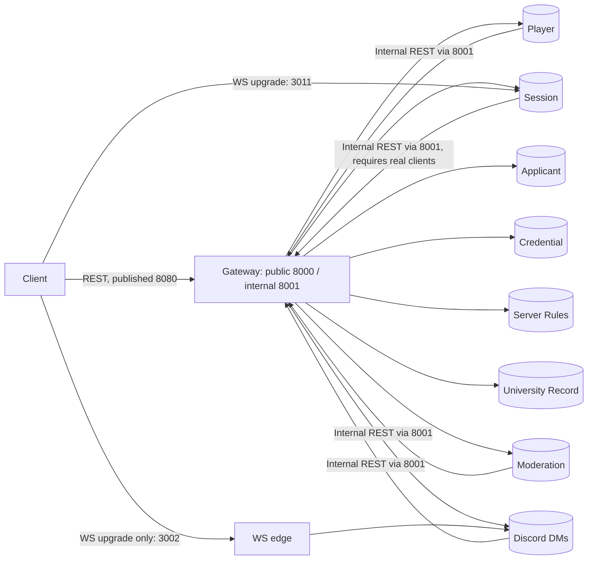
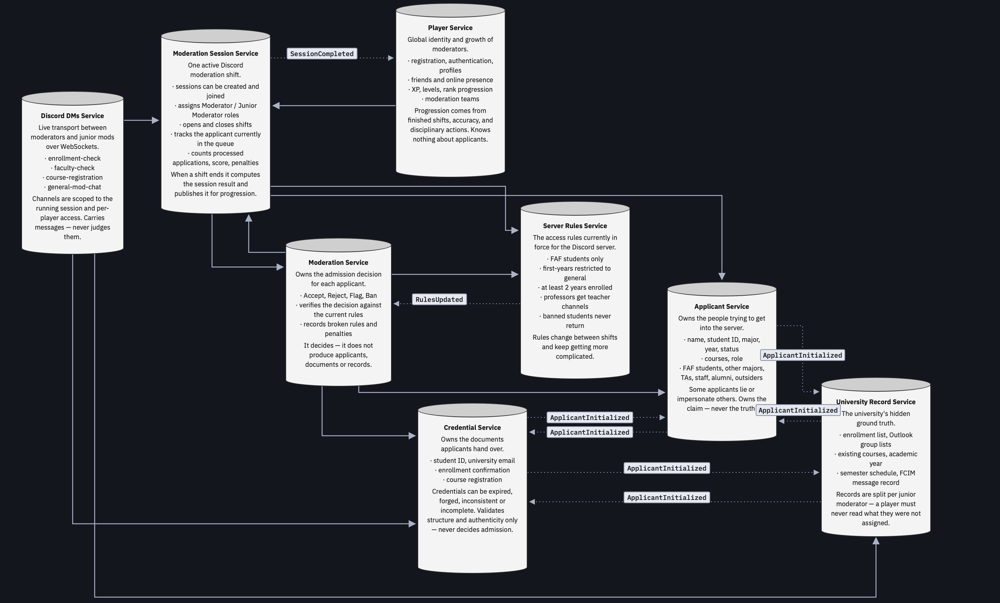
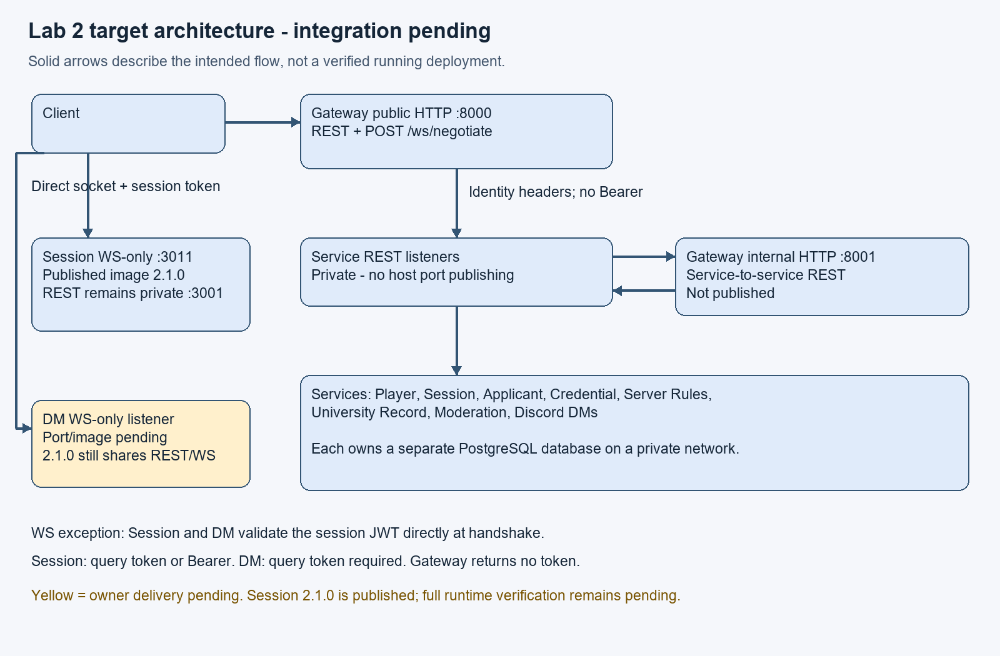

# Student ID, please

A game set in a university Discord server where a moderation team decides who gets access, based on credentials and information that may or may not be true. Each round an applicant arrives at the door: a student, an alumnus, a staff member or an outsider, presenting documents that may be forged, expired or simply someone else's. One player acts as Moderator and makes the call; the rest are Junior Moderators who each hold a different slice of the university's records and have to piece the truth together over chat before the Moderator decides.

## Contents

- [Service Boundaries](#service-boundaries)
- [Architecture Diagram](#architecture-diagram)
- [Technologies and Communication Patterns](#technologies-and-communication-patterns)
- [Communication Contract](#communication-contract)
- [Running the System](#running-the-system)
- [GitHub Workflow](#github-workflow)
- [Project Board](#project-board)

## Service Boundaries

The system has eight domain services and a Gateway that routes and authenticates
REST requests. Each domain service owns its own data and business rules.

### 1. Player Service
Responsible for the identity of the players. Stores accounts, authentication, profiles, friends and XP/Levels. Tracks persistent player progression through leveling, based on moderator experience, completed shifts and disciplinary actions.

It holds nothing about the people attempting to join the server.

### 2. Server Moderation Session Service
Manages an active Discord moderation session. A session represents one moderation shift and contains a Moderator and several Junior Moderator players. Handles creating and joining sessions, assigning roles, starting/ending shifts, the current applicant, number of applications processed, and session score and penalties.

It is also the authority on role to access mapping: which Junior Moderator was assigned which records and which chat channels.

### 3. Applicant Service
Owns the people attempting to access the server. Generates applicants with information such as name, student ID, major, year, university status, courses and role, covering FAF students, students from other majors, teaching assistants, university staff, alumni and outsiders. Some applicants are generated with false information or as impersonation attempts.

It owns what the applicant *claims*, not whether the claim is true.

### 4. Credential Service
Owns the documents and credentials presented by applicants, such as student ID, university email, enrollment confirmation and course registration. Validates the structure and authenticity of credentials, which can be expired, forged, inconsistent or incomplete.

It decides whether a document is sound, never whether the applicant should be admitted.

### 5. Server Rules Service
Owns the current rules for accessing the Discord server. Rules can change between shifts and grow increasingly complex. Evaluates applicants against the current access rules.

It stores no applicant data of its own; it is handed what it needs per request and returns a verdict.

### 6. University Record Service
Provides the hidden university information moderators may need to verify an applicant, such as enrollment lists, email group lists, existing courses, academic year, semester schedule and server message records. This information is deliberately distributed among junior mod players, and the service enforces that a player cannot read a record type they were not assigned.

### 7. Moderation Service
Owns the admission decision for each applicant. The Moderator can Accept, Reject, Flag or Ban an applicant. Determines whether a decision was correct according to the current server rules, and records the applicant, decision, violated rules, penalties and outcome.

### 8. Discord DMs Service
Provides real-time communication between the moderator and the junior mods, over a Discord-like WebSocket interface. Manages channels tied to the current moderation session, with different players having access to different channels.

It transports messages and never judges whether what is said is correct.

### 9. Gateway Service

Python / FastAPI. Validates Player and Session tokens, forwards caller identity
without Authorization, separates public and internal REST, and applies task
timeout and concurrency limits. It owns no domain database. Its authenticated
`POST /ws/negotiate` endpoint returns the direct Session or DM WebSocket URL.

## Architecture Diagram

Lab 2 deployment topology (configured by common Compose):


```mermaid
flowchart LR
    client[Client] -->|REST, published 8080| gateway[Gateway: public 8000 / internal 8001]
    gateway --> player[(Player)]
    gateway --> session[(Session)]
    gateway --> applicant[(Applicant)]
    gateway --> credential[(Credential)]
    gateway --> rules[(Server Rules)]
    gateway --> records[(University Record)]
    gateway --> moderation[(Moderation)]
    gateway --> dm[(Discord DMs)]
    player -->|Internal REST via 8001| gateway
    session -->|Internal REST via 8001, requires real clients| gateway
    moderation -->|Internal REST via 8001| gateway
    dm -->|Internal REST via 8001| gateway
    client -->|WS upgrade: 3011| session
    client -->|WS upgrade only: 3002| ws[WS edge]
    ws --> dm
```

Only Gateway publishes REST. Session and DM still validate Session tokens at
their WS handshakes. Neither published WS port carries a REST route, so
neither can be used to forge Gateway identity: Session answers `426` on a
listener that serves upgrades alone, and the WS edge refuses anything that is
not DM's upgrade path. Gateway negotiates their public URLs
using SESSION_PUBLIC_WS_BASE_URL and DM_PUBLIC_WS_BASE_URL. Read
[integration status](docs/gateway-integration.md) for
the image/client dependencies before treating this topology as a finished game.

The original domain-interaction diagram remains useful for business ownership:



Each cylinder is a service with its own database. A solid arrow is a synchronous
REST call, pointing from the caller to the service it calls. A dotted arrow is an
asynchronous RabbitMQ event, labelled with its name and pointing from publisher
to consumer.

Every solid REST arrow in this domain diagram goes through Gateway's internal
listener in Lab 2. The domain responsibilities remain independent:

- **Player** opens a session for a team, and hears back from Session through
  `SessionCompleted` to award progression.
- **Session** runs the shift: it asks Server Rules for the shift's rule set,
  Applicant for each applicant, and Moderation for the decision log when the
  shift ends.
- **Moderation** judges each decision on its own. It reads the claim from
  Applicant, has Credential check the documents, asks Server Rules for the
  correct verdict under the rule set it last heard about through `RulesUpdated`,
  and reports the outcome to Session.
- **Applicant, Credential and University Record** form a ring with no owner:
  whichever is contacted first creates the applicant and announces it with
  `ApplicantInitialized`, which is why every pair has an event in both
  directions.
- **Discord DMs** checks channel access with Session, and fetches a document
  from Credential or a record from University Record when a player shares one
  into a channel.

## Technologies and Communication Patterns

We work in two languages, and the split follows the service pairs each of us
owns: two of us write our two services in **TypeScript (NestJS)**, the other two
write theirs in **PHP (Laravel)**. The pairs were drawn so that the language
boundary mostly falls along a natural seam in the system — the services that
coordinate the game and push real-time updates (Session, Moderation, Discord
DMs) are TypeScript, and the services that generate, store and validate data
(Applicant + Credential, Server Rules + University Record) are PHP. The one
exception is Player, which is TypeScript because it shares an owner with
Session (see below). Nobody has to switch stacks mid-semester.

TypeScript/NestJS earns its place on the real-time and orchestration cluster.
NestJS ships WebSocket gateways and a built-in microservice/event transport, so
the two real-time surfaces (moderator chat, live session state) and the event
fan-out come from the framework instead of being bolted on. Its type system
also keeps the heavily typed contract below honest at compile time.

Player Service is TypeScript for an ownership reason, not a technical one. On
its own it is CRUD, JWT issuance, one outbound call and one event consumer, and
would sit comfortably in Laravel — it started there. It moved because the same
teammate owns Player and Session, and Session has to be TypeScript. One person on
one stack is worth more than the marginally better fit, and the contract between
them (`POST /sessions` and `SessionCompleted`) is small enough that nothing is
lost either way.

PHP/Laravel earns its place on the data cluster. These four services are mostly
CRUD and payload validation — generate a coherent (and often deliberately
inconsistent) applicant, store records, check a document against a schema — and
Eloquent together with Laravel's form-request validation cover exactly that with
little ceremony. It is also the stack their owners are fastest in, which matters
under a weekly lab cadence: a working, well-understood service beats a
marginally lighter one we have to fight. The trade-off is that Laravel is a
heavier runtime than a PHP microframework, and PHP is weaker at long-lived
real-time and async work than Node — which is precisely why the real-time and
orchestration cluster is TypeScript, not PHP. Where these services consume
events, they do so through a long-running worker (php-amqplib), not inside the
request cycle.

Every service owns its own PostgreSQL database. No service reads another's
tables; the only route to another service's data is through its endpoints or
its events. This is deliberate — a shared database would let us skip the
contract, which is the one thing Lab 0 exists to force us to get right.

| Service | Language / Framework | Datastore | Talks via | Why |
|---|---|---|---|---|
| Player | TypeScript / NestJS | PostgreSQL | REST, consumes events | Identity, friends and levels; same owner as Session, so same stack |
| Session | TypeScript / NestJS | PostgreSQL | REST, WebSocket, events | Runs the shift, pushes live state, owns role→access |
| Applicant | PHP / Laravel | PostgreSQL | REST, events both ways | Presented claim and deception; can start an applicant |
| Credential | PHP / Laravel | PostgreSQL | REST, events both ways | Signs, stores and validates documents; can start an applicant |
| Server Rules | PHP / Laravel | PostgreSQL | REST, publishes events | Rule generation, storage and verdict evaluation |
| University Record | PHP / Laravel | PostgreSQL | REST, events both ways | Access-controlled ground-truth store; can start an applicant |
| Moderation | TypeScript / NestJS | PostgreSQL | REST, consumes events | Decides and scores the admission from Applicant, Credential and Rules |
| Discord DMs | TypeScript / NestJS | PostgreSQL | WebSocket, REST | Real-time per-session chat |
| Gateway | Python / FastAPI | None | REST, WS URL negotiation | Validates tokens, routes and limits requests |

Three communication patterns are in use, each where it fits:

- **Synchronous REST** is the default, for any call where the caller needs an
  answer before it can continue: opening a session, fetching the next applicant,
  everything Moderation gathers to judge a decision, reporting that outcome to
  Session so the score updates at once, and the channel checks and evidence
  lookups made by Discord DMs.
- **WebSockets** carry the two real-time surfaces: the moderator / junior-mod
  chat in Discord DMs, and the live session state (current applicant, score)
  pushed by Session.
- **Asynchronous events** (RabbitMQ) carry the three fire-and-forget paths where
  the sender does not wait for the receiver: a new applicant, announced by
  whichever of Applicant, Credential and University Record created it to the
  other two; Server Rules announcing a new rule set to Moderation; and Session
  publishing the shift result to Player.

---

## Communication Contract

### Conventions

**Auth.** A caller authenticates once, at the Gateway. It is the only service
reachable from outside; the rest sit on internal networks and answer nothing
that did not come through it.

There are two kinds of JWT, both RS256, each still issued by the service that
owns it and signed with that service's private key. The Gateway holds both
issuers' public keys, and is the only place a token is checked.

- The **player token** is issued by Player Service on login and carries `sub`
  (the `playerId`). It is enough for player-scoped calls: profile, friends,
  teams.
- The **session token** is issued by Session when a player enters a session:
  to the moderator when Player opens it, and to junior mods on
  `POST /sessions/{id}/join`. `POST /sessions/{id}/token` re-issues it. It
  carries `sub`, `sessionId`, `role` and `recordAccess`, and expires after 15
  minutes. Session-scoped calls carry it: document and record reads, channel
  reads, decisions, and the two WebSocket handshakes.

Which token a call carries is unchanged; what changed is that the Gateway is
what reads it.

Every REST call except `POST /auth/*` carries `Authorization: Bearer <token>`
**to the Gateway**, which answers `401 INVALID_TOKEN` itself when it is missing,
expired or wrongly signed. `POST /auth/*` passes through untouched, since a
caller cannot present a token before logging in.

**The Gateway does not forward `Authorization`.** It validates the token, drops
the header, and passes what it learned to the service as headers:

| Header | Sent on | Value |
|---|---|---|
| `X-Player-Id` | every authenticated call | the token's `sub` |
| `X-Session-Id` | calls made with a session token | its `sessionId` |
| `X-Session-Role` | calls made with a session token | `moderator` or `junior_mod` |
| `X-Record-Access` | calls made with a session token | the record types, comma separated; sent empty when the player has none |

For REST, a service therefore never sees a token: it reads the identity from
these headers and trusts them, because nothing but the Gateway can reach it. A
service must not publish a port of its own, and a deployment that exposes one
breaks this guarantee for everybody.

Two things stay with the services. Player and Session keep their **private**
keys, because they still issue the tokens. Session and Discord DMs keep
Session's **public** key, for the WebSocket handshakes described below, which
do not pass through the Gateway. No other service holds a key.

**Internal endpoints.** Endpoints marked *internal* are called by another
service, never by a client, and every call between services goes through the
Gateway too. The Gateway is what keeps them internal: it refuses to route those
paths for a caller from outside. This replaces the shared `X-Service-Secret`
header used before the Gateway existed.

A service-to-service call carries no token: the caller is a service, not a
person, and the token was already consumed at the Gateway on the way in.
Usually it carries no identity either, because nobody in particular is asking:
Session asking Server Rules for a rule set, or any of the three services being
asked to start an applicant.

**Which door a request arrives at is what decides this.** The Gateway listens
on two ports:

| Port | Published outside | Serves |
|---|---|---|
| `8000` | yes | everything except endpoints marked *internal* |
| `8001` | no | everything, including internal endpoints |

A client can only reach `8000`, where an internal path answers
`403 INTERNAL_ENDPOINT`. Services reach `8001`, which is not published beyond
the Docker network, and call each other there:

```
http://gateway:8001/<service>/<path>
```

So `POST /sessions` becomes `POST http://gateway:8001/session/sessions` when
Player opens a shift. What a request may do depends on where it entered, not on
a secret each service checks.

**A service acting for a player says so.** Sometimes the caller is a service
but the request is still on someone's behalf: Discord DMs reads a record
because a player asked to share it, and University Record must apply *that
player's* record access, not Discord DMs'. The calling service therefore
forwards the four identity headers it received, unchanged, and the Gateway
passes them through on the internal port rather than stripping them as it does
on the public one.

A service that receives no identity headers must not fall back to allowing the
read: a per-applicant record read without `X-Record-Access` is `403`, the same
as a read whose access does not cover that record.

The trade-off is deliberate, and it is the consequence of having a single
authentication boundary: on the internal port any service can set those
headers to anything, so anything already inside the system is trusted.

**WebSockets are the exception.** The Gateway negotiates the connection and
hands the client a URL to reach the service directly, so it is not left sitting
in the middle of a long-lived socket. Those connections never pass through it
and carry no injected headers, so the services that own a socket, Session and
Discord DMs, validate the session token themselves on the handshake, against
Session's public key.

**Types.** `UUID` = RFC-4122 string. `timestamp` = ISO-8601 UTC. `date` =
ISO-8601 date. `enum(...)` = closed string set. All bodies are
`application/json`.

**Error envelope.**

```json
{ "error": "APPLICANT_NOT_FOUND", "message": "human readable", "details": {} }
```

Common statuses: `400` bad payload, `401` no/invalid token, `403` record,
document or channel access denied, `404` missing, `408` the request took longer
than the service allows, `409` conflict/idempotency, `422` validation, `429`
the service is already handling as many requests as it allows at once, sent
with a `Retry-After` header. A `422` carries `"error":"VALIDATION_FAILED"`,
with the field errors in `details`.

**Event envelope.** Async events travel through RabbitMQ as:

```json
{ "eventId": "UUID", "type": "ApplicantInitialized",
  "occurredAt": "timestamp", "sessionId": "UUID", "payload": {} }
```

Consumers are idempotent on `eventId` and on the domain key (`applicantId`,
`ruleSetVersion`, `sessionId`), so a redelivery never applies twice.

**Broker.** Every event of every type goes to one durable `fanout` exchange,
`pad.events`, as persistent JSON with an empty routing key. Each service that
consumes declares its own durable queue, named after the service, and binds it
to that exchange:

| Queue | Consumes |
|---|---|
| `applicant`, `credential`, `university-record` | `ApplicantInitialized` |
| `moderation` | `RulesUpdated` |
| `player` | `SessionCompleted` |

Declare both exactly so, durable, not auto-deleted and without arguments:
RabbitMQ refuses a declaration that differs from the one already there. A
fanout exchange copies each event to every queue, so a consumer acknowledges
and skips the types it does not handle. Session and Server Rules only publish
and need no queue. An event published before a queue was first declared never
reaches it, which is why a consumer declares its queue as soon as it starts.

Every service reads the connection from the same variables:

| Variable | Value |
|---|---|
| `RABBITMQ_HOST` | `rabbitmq` in Compose |
| `RABBITMQ_PORT` | `5672` |
| `RABBITMQ_USER` | `pad` in Compose |
| `RABBITMQ_PASSWORD` | from `.env` |
| `RABBITMQ_EXCHANGE` | `pad.events` |
| `RABBITMQ_QUEUE` | the service's queue above |

**Transport legend.** Each endpoint is tagged `[REST]`, `[EVENT]` or `[WS]`.

### Data management and the applicant bootstrap

Each service keeps its own database and nothing is shared. The one flow that
spans services is creating an applicant, and **no service is in charge of it**.
Applicant, Credential and University Record each expose the same
`POST /applicants {sessionId}`. Whichever one is contacted first generates the
whole coherent story, keeps its own slice, and publishes the story as
`ApplicantInitialized`. The other two consume it and materialize their slices.
None of the three waits on another and none is a required entry point. Session
calls Applicant today, but if Applicant is down it can call either of the others
and get the same kind of applicant; Applicant catches up from its queue when it
comes back.

All three are Laravel and generate with the same `StoryGenerator` class, copied
unchanged into each service, so a story looks the same whichever service starts
it. They all publish to and
consume from one fanout exchange. A service that already has the `applicantId`,
including the one that published it, acknowledges the event and skips it.

The story has four parts: what the applicant *presents* at the door (which may
be false), the *ground truth* in the records, the *documents* they hand over,
and the *deception* metadata linking them.

```json
// ApplicantInitialized.payload
{
  "applicantId": "UUID",
  "sessionId": "UUID",
  "origin": "enum(applicant|credential|university_record)",  // contacted first
  "presented": {                       // Applicant keeps
    "name": "string", "studentId": "string", "major": "string", "year": "int",
    "role": "enum(student|other_major|ta|staff|alumni|outsider)",
    "universityStatus": "enum(enrolled|graduated|expelled|none)",
    "courses": ["string"]
  },
  "groundTruth": {                     // University Record keeps
    "exists": "bool", "realStudentId": "string|null", "realMajor": "string|null",
    "realYear": "int|null",
    "realStatus": "enum(enrolled|graduated|expelled|banned|none)",
    "enrolledCourses": ["string"], "email": "string|null",
    "previouslyBanned": "bool"
  },
  "documents": [                       // Credential keeps
    { "type": "enum(student_id|university_email|enrollment_confirmation|else_registration)",
      "fields": {},                    // per type, see Credential Service
      "status": "enum(valid|expired|forged|inconsistent|incomplete)" }
  ],
  "deception": {                       // Applicant keeps
    "isImpostor": "bool",
    "strategy": "enum(none|forged_document|expired_document|identity_theft|wrong_major|banned_retry)",
    "mismatchedFields": ["string"]
  }
}
```

The correct decision is never in the payload. Moderation derives it at decision
time (see Moderation Service).

### Player Service

| Method & path | Request | Response |
|---|---|---|
| `POST /auth/register` `[REST]` | `{username, email, password}` | `201 {playerId, token}` |
| `POST /auth/login` `[REST]` | `{email, password}` | `200 {token, refreshToken, playerId}` |
| `POST /auth/refresh` `[REST]` | `{refreshToken}` | `200 {token}` |
| `GET /players/{id}` `[REST]` | — | `200 PlayerProfile` |
| `PATCH /players/{id}` `[REST]` | `{displayName?, avatar?}` | `200 PlayerProfile` |
| `GET /players/{id}/progression` `[REST]` | — | `200 {xp, level, completedShifts, disciplinaryActions}` |
| `GET /players/{id}/friends` `[REST]` | — | `200 [{playerId, username, status}]` |
| `POST /players/{id}/friends` `[REST]` | `{friendId}` | `201 {status:"pending"\|"accepted"}` |
| `DELETE /players/{id}/friends/{friendId}` `[REST]` | — | `204` |
| `POST /teams` `[REST]` | `{name, ownerId}` | `201 {teamId}` |
| `GET /teams/{id}` `[REST]` | — | `200 {teamId, name, ownerId, members[]}` |
| `POST /teams/{id}/members` `[REST]` | `{playerId}` | `201` |
| `DELETE /teams/{id}/members/{playerId}` `[REST]` | — | `204` |
| `POST /teams/{id}/sessions` `[REST]` | — *(caller becomes moderator; must be a member)* | `201 {sessionId, sessionToken}` *(calls Session)* |

A shift is opened from the team because the team lives here. Player checks that
the caller is a member and hands Session the roster with each member's level, so
Session never has to ask Player who someone is.

```json
// PlayerProfile — displayName and avatar are null until PATCH sets them
{ "playerId":"UUID", "username":"string", "email":"string",
  "level":"int", "xp":"int", "displayName":"string|null",
  "avatar":"string|null", "createdAt":"timestamp" }

// One entry of a team's members[]
{ "playerId":"UUID", "username":"string", "level":"int" }
```

`PlayerProfile` carries `email`, so a player reads and edits only their own. A
team's `members[]` therefore names each member, since an id alone could not be
turned into a username, and carries `level` because that is what Session's
roster needs.

**Consumes** `SessionCompleted` → award XP, increment `completedShifts`, apply
`disciplinaryActions`. Levels follow XP: one level per 100 XP.

### Server Moderation Session Service

| Method & path | Request | Response |
|---|---|---|
| `POST /sessions` `[REST]` | `{teamId, moderatorId, members:[{playerId, level}]}` *(internal, Player)* | `201 {sessionId, status:"lobby", sessionToken}` |
| `POST /sessions/{id}/join` `[REST]` | — *(player token; must be on the roster)* | `200 {role:"junior_mod", sessionToken}` \| `403` |
| `POST /sessions/{id}/roles` `[REST]` | `{assignments:[RoleAssignment]}` | `200` |
| `POST /sessions/{id}/start` `[REST]` | — | `200 {status:"active", startedAt, ruleSetVersion}` *(calls Server Rules)* |
| `POST /sessions/{id}/token` `[REST]` | — | `200 {sessionToken}` *(current role and recordAccess)* |
| `POST /sessions/{id}/next-applicant` `[REST]` | — | `202 {applicantId}` *(calls Applicant)* |
| `GET /sessions/{id}/current-applicant` `[REST]` | — | `200 {applicantId}` |
| `POST /sessions/{id}/outcomes` `[REST]` | `{decisionId, applicantId, correct, penalty}` *(internal, Moderation)* | `200` |
| `POST /sessions/{id}/end` `[REST]` | — | `200 SessionResult` *(reads the decision log from Moderation, emits SessionCompleted)* |
| `GET /sessions/{id}` `[REST]` | — | `200 SessionState` |
| `GET /sessions/{id}/results` `[REST]` | — | `200 SessionResult` |
| `GET /sessions/{id}/access-check` `[REST]` | `?playerId=&channel=` *(internal, Discord DMs)* | `200 {allowed:bool}` |
| `WS /sessions/{id}/live` `[WS]` | — | server pushes state changes |

```json
// RoleAssignment — drives both record access and channel access
{ "playerId":"UUID", "role":"enum(moderator|junior_mod)",
  "recordAccess":["enum(enrollment|emails|courses|schedule|fcim)"],
  "channelAccess":["string"] }

// SessionState
{ "sessionId":"UUID", "status":"enum(lobby|active|ended)",
  "moderatorId":"UUID", "juniorMods":["UUID"],
  "currentApplicantId":"UUID|null",
  "applicationsProcessed":"int", "score":"int", "penalties":"int" }

// SessionResult
{ "sessionId":"UUID", "score":"int", "penalties":"int",
  "applicationsProcessed":"int", "correctDecisions":"int",
  "perPlayer":[{"playerId":"UUID","xpAwarded":"int","disciplinaryActions":"int"}] }
```

> **Two different "access" ideas — do not conflate them.** `RoleAssignment` here
> governs *which member of the moderation team may read which record or channel*
> — a moderator-side permission, carried in the session token and checked
> through `access-check`. It is unrelated to `allowedChannels` in a
> `RuleVerdict` (Server Rules), which is part of the *applicant's* outcome: which
> Discord channels that applicant would be allowed into if admitted. One is about
> the players at the desk; the other is about the person at the door.

`WS /sessions/{id}/live` pushes: `{type:"shift_started", ruleSetVersion}` (the
client then calls `POST /sessions/{id}/token` to pick up its `recordAccess`),
`{type:"applicant_changed", applicantId}`, `{type:"score_updated", score,
penalties}`, `{type:"shift_ended", result}`.

On `start`, Session asks Server Rules for the shift's rule set, passing the
moderator's level so later shifts get harder. On each outcome from Moderation it
updates score / penalties / `applicationsProcessed` and advances the current
applicant. On `end` it reads the decision log from Moderation, so the final
result comes from the authoritative record, not from its running counters.

**How the numbers are reached.** `penalties` is the sum of the `penalty` values
Moderation reported, and `score` is 10 points per correct decision minus the
penalties. At the end of a shift the moderator earns the shift's score as XP and
each junior mod who joined earns half of it, never below zero, and a player's
`disciplinaryActions` counts their own decisions that carried a penalty. Only
the moderator decides, so only the moderator can collect them.

**Publishes** `SessionCompleted { sessionId, perPlayer[] }`.

Session is the authority on role→access. Record access goes into the session
token, and reaches University Record as `X-Record-Access` once the Gateway has
read the token, so neither service calls back here. Channel access is checked
live through `access-check`, because a Discord DMs socket stays open for the
whole shift while a token only lives 15 minutes.

### Applicant Service

| Method & path | Request | Response |
|---|---|---|
| `POST /applicants` `[REST]` | `{sessionId}` *(internal, Session)* | `201 {applicantId}` *(generates the story, emits ApplicantInitialized)* |
| `GET /applicants/{id}` `[REST]` | *(internal, Moderation — includes impostor flag)* | `200 Applicant` |
| `GET /applicants/{id}/public` `[REST]` | — *(session token of the applicant's session, any role)* | `200 ApplicantPublic` *(what the moderator sees)* \| `401` \| `403` \| `404` |
| `GET /applicants?sessionId=` `[REST]` | — *(session token of that session)* | `200 [ApplicantPublic]` \| `401` \| `403` |

```json
// ApplicantPublic — presented info only, may be false by design
{ "applicantId":"UUID", "name":"string", "studentId":"string",
  "major":"string", "year":"int",
  "role":"enum(student|other_major|ta|staff|alumni|outsider)",
  "universityStatus":"enum(enrolled|graduated|expelled|none)",
  "courses":["string"] }

// Applicant — adds internal fields, never exposed to players
{ "...ApplicantPublic":"...", "isImpostor":"bool", "strategy":"string" }
```

**Publishes** `ApplicantInitialized` when contacted first.
**Consumes** `ApplicantInitialized` → materialize the `presented` and
`deception` slice.

### Credential Service

Credential holds the documents an applicant hands over at the door. It stores
them, signs them, shows them to the moderator, and tells Moderation whether each
one is sound. It never decides whether the applicant gets in, and never checks a
document against the university's records; catching a genuine document in the
wrong hands is the players' job.

**Gateway identity.** Clients send a session token to Gateway, which validates
it, removes Authorization and injects identity headers. Credential validates
the player/session UUIDs and session role (`401 INVALID_GATEWAY_IDENTITY` when
missing or malformed), then enforces:

1. The identity's `sessionId` equals the `sessionId` stored for the applicant (from
   `ApplicantInitialized`). Otherwise `403 SESSION_MISMATCH`.
2. The identity's `role` is `moderator`. Otherwise `403 ROLE_NOT_ALLOWED`. The
   documents are handed to the moderator; a junior mod sees one only when the
   moderator shares it into a channel, and then Discord DMs makes the call with
   the moderator's forwarded identity through Gateway port 8001.

| Method & path | Request | Response |
|---|---|---|
| `POST /applicants` `[REST]` | `{sessionId}` *(internal, Session)* | `201 {applicantId}` *(generates the story, emits ApplicantInitialized)* |
| `GET /applicants/{id}/credentials` `[REST]` | — *(session token, moderator)* | `200 [Credential]` \| `401` \| `403` \| `404` |
| `GET /credentials/{id}` `[REST]` | — *(session token, moderator)* | `200 Credential` \| `401` \| `403` \| `404 CREDENTIAL_NOT_FOUND` |
| `POST /applicants/{id}/credentials/validate` `[REST]` | — *(internal, Moderation)* | `200 CredentialValidation` \| `404` |

Right after an applicant is created, a read may return `404 APPLICANT_NOT_FOUND`
until Credential has consumed `ApplicantInitialized`; clients retry.

**Document fields.** `fields` depends on `type`. Unmarked fields are strings,
and every listed field is required: a document missing one is `incomplete` by
design, not a bad request.

| `type` | `fields` |
|---|---|
| `student_id` | `studentId`, `fullName`, `faculty`, `major`, `year:int`, `issuedAt:date`, `expiresAt:date` |
| `university_email` | `address`, `fullName`, `issuedAt:date` |
| `enrollment_confirmation` | `studentId`, `fullName`, `faculty`, `major`, `year:int`, `academicYear`, `enrollmentStatus:enum(enrolled\|graduated\|expelled)`, `issuedAt:date`, `expiresAt:date` |
| `else_registration` | `studentId`, `fullName`, `academicYear`, `semester:enum(autumn\|spring)`, `courses:[string]`, `issuedAt:date` |

`else_registration` is course registration on ELSE, the university's e-learning
platform.

```json
// Credential — what the moderator sees; the signature stays inside
{ "credentialId":"UUID", "applicantId":"UUID",
  "type":"enum(student_id|university_email|enrollment_confirmation|else_registration)",
  "fields":{} }                       // per type, table above

// e.g. a student ID
{ "credentialId":"UUID", "applicantId":"UUID", "type":"student_id",
  "fields":{ "studentId":"FAF230042", "fullName":"Ana Rusu", "faculty":"FCIM",
             "major":"FAF", "year":3, "issuedAt":"2023-09-01",
             "expiresAt":"2027-06-30" } }

// CredentialValidation — internal, Moderation only
{ "applicantId":"UUID", "documentsValid":"bool",
  "results":[
    { "credentialId":"UUID", "type":"string",
      "structurallyValid":"bool", "authentic":"bool",
      "issues":[{ "code":"enum(missing_field|malformed_field|expired|signature_mismatch|field_conflict)",
                  "field":"string|null" }] } ] }
```

**On `ApplicantInitialized`** (skipped if the `applicantId` is already stored),
for each entry in `documents`:

1. Store `fields` as given, together with the applicant's `sessionId`.
   Incomplete documents are meant to lack fields, so nothing is rejected here.
2. Sign it. `signature` is an HMAC-SHA256 over the canonical JSON of `fields`,
   keyed by a university issuer secret that only Credential holds. A `forged`
   document is signed with a random key instead, so it looks like any other
   document but will not verify.
3. Drop `status`. It only told Credential how to sign; validation below reaches
   the same answer from the document itself.

**On validate**, each document goes through these checks, and every failed check
adds an issue:

| Check | Issue | Effect |
|---|---|---|
| A required field for the type is absent or empty | `missing_field` | `structurallyValid: false` |
| A field has the wrong shape: `studentId` not `^[A-Z]{2,4}\d{6}$`, `address` not on a `utm.md` domain, a date not ISO-8601, an enum value outside its set | `malformed_field` | `structurallyValid: false` |
| `expiresAt` is before today | `expired` | — |
| `signature` does not verify | `signature_mismatch` | `authentic: false` |
| `studentId`, `fullName`, `faculty` or `major` differs from the same field on another of the applicant's documents | `field_conflict` | — |

A document is sound when it has no issues; `documentsValid` is true only when
every document is sound. Validation reads nothing outside Credential (not the
claim, not the records), so a genuine document carried by the wrong person
passes. That case is left to the players.

**Publishes** `ApplicantInitialized` when contacted first.
**Consumes** `ApplicantInitialized` → materialize the `documents` slice as above.

### Server Rules Service

Session asks for a fresh rule set when a shift starts. Every rule set opens with
two base rules, `is_genuine` and `documents_valid`; the moderator's `level`
decides how many others are stacked on top, which is how the rules keep getting
harder between shifts. Each new rule set is announced as `RulesUpdated`.

| Method & path | Request | Response |
|---|---|---|
| `POST /rules` `[REST]` | `{sessionId, level}` *(internal, Session)* | `201 RuleSet` *(emits RulesUpdated)* |
| `GET /rules/current?sessionId=` `[REST]` | — | `200 RuleSet` |
| `GET /rules/{ruleSetVersion}` `[REST]` | — | `200 RuleSet` |
| `POST /rules/evaluate` `[REST]` | `{subject, ruleSetVersion}` *(internal, Moderation)* | `200 RuleVerdict` |

```json
// Rule
{ "id":"UUID",
  "predicate":"enum(is_genuine|documents_valid|is_faf|min_years_enrolled|is_enrolled|not_previously_banned|role_allows_channel)",
  "params":{},                        // e.g. {"minYears":2} or {"channel":"#groapa"}
  "effect":"enum(allow|restrict_channels|flag|deny|ban)" }

// RuleSet
{ "ruleSetVersion":"int", "sessionId":"UUID", "rules":["Rule"] }

// Subject — what the rules are evaluated against, assembled by Moderation
{ "claim":{ "role":"enum(student|other_major|ta|staff|alumni|outsider)",
            "major":"string", "year":"int",
            "universityStatus":"enum(enrolled|graduated|expelled|none)" },
  "genuine":"bool",                   // Applicant: not isImpostor
  "previouslyBanned":"bool",          // Applicant: strategy is banned_retry
  "documentsValid":"bool" }           // Credential: CredentialValidation.documentsValid

// RuleVerdict — the correct answer
{ "verdict":"enum(accept|reject|flag|ban)",
  "allowedChannels":["string"],
  "violations":[{"ruleId":"UUID","predicate":"string"}] }
```

The verdict is the most severe effect among the rules that fire: `ban`, then
`deny` (→ `reject`), then `flag`, otherwise `accept`. The rules read the claim,
not the records: for a genuine applicant the claim is the truth, and a
non-genuine one already fails `is_genuine`.

**Publishes** `RulesUpdated { sessionId, ruleSetVersion }`.

### University Record Service

Reads split into two kinds. **Per-applicant** records (`enrollment`, `emails`,
`schedule`, `fcim-messages`) are keyed by `applicantId` and access-controlled
from the session token alone: its `sessionId` must match the applicant's session
and its `recordAccess` must include the record type, otherwise `403`. The
service never calls Session, because Session wrote the assignment into the token
when it issued it. **Reference** records are session-global: `courses` is the
current course catalog — still gated by the `courses` assignment, but not
applicant-specific — and `academic-year` is open reference data that needs no
assignment and is never `403`.

Reads come from the junior mods' client, and from Discord DMs when a player
shares a record into a channel, made with that player's token.

| Method & path | Request | Response |
|---|---|---|
| `POST /applicants` `[REST]` | `{sessionId}` | `201 {applicantId}` *(generates the story, emits ApplicantInitialized)* |
| `GET /records/enrollment?applicantId=` `[REST]` | — | `200 {enrolled, studentId, major, year, status}` \| `403` |
| `GET /records/emails?applicantId=` `[REST]` | — | `200 {email, inGroupList}` \| `403` |
| `GET /records/courses` `[REST]` | *(global, gated by `courses` assignment)* | `200 {courses:[string]}` \| `403` |
| `GET /records/academic-year` `[REST]` | *(global, open reference)* | `200 {year, semester:enum(autumn\|spring)}` |
| `GET /records/schedule?applicantId=` `[REST]` | — | `200 {entries:[{course, day, time}]}` \| `403` |
| `GET /records/fcim-messages?applicantId=` `[REST]` | — | `200 {messages:[{author, text, ts}]}` \| `403` |

**Publishes** `ApplicantInitialized` when contacted first.
**Consumes** `ApplicantInitialized` → materialize the `groundTruth` slice.

### Moderation Service

On `POST /decisions` the service (1) reads the claim and deception from
Applicant (`GET /applicants/{id}`), (2) has Credential check the documents
(`POST /applicants/{id}/credentials/validate`), (3) builds a `Subject` from the
two and calls `POST /rules/evaluate` with the `ruleSetVersion` from the last
`RulesUpdated` for the session, (4) compares the moderator's `action` with the
verdict, (5) records the `Decision`, and (6) reports it to Session
(`POST /sessions/{id}/outcomes`) before responding, so the moderator's score is
already updated when the call returns.

It never reads University Record. The deception written at generation time is
the answer key, so Moderation does not have to re-derive the truth the players
are hunting for.

| Method & path | Request | Response |
|---|---|---|
| `POST /decisions` `[REST]` | `{sessionId, applicantId, moderatorId, action:enum(accept\|reject\|flag\|ban)}` | `201 Decision` |
| `GET /decisions/{id}` `[REST]` | — | `200 Decision` |
| `GET /sessions/{id}/decisions` `[REST]` | *(also read by Session at shift end)* | `200 [Decision]` |

```json
// Decision
{ "decisionId":"UUID", "sessionId":"UUID", "applicantId":"UUID",
  "moderatorId":"UUID", "action":"enum(accept|reject|flag|ban)",
  "correct":"bool",
  "violatedRules":[{"ruleId":"UUID","predicate":"string"}],
  "penalty":"int",
  "outcome":"enum(correct|wrong_admit|wrong_reject|missed_ban)",
  "decidedAt":"timestamp" }
```

**Consumes** `RulesUpdated` → remember the current `ruleSetVersion` per session.

### Discord DMs Service

Channel access comes from the caller's `channelAccess` for the session, checked
against Session's `access-check`. A session's default channels are
`enrollment-check`, `faculty-check`, `course-registration` and
`general-mod-chat`. The service transports messages and never judges whether
what is said is correct.

**Sharing evidence.** A player can drop a document or one of their records into
a channel. Discord DMs fetches it from Credential or University Record on *the
sender's* behalf, forwarding the identity headers it received, so the owning
service applies its own rules to that player (a junior mod cannot share a
document, nobody can share a record they were not assigned), then posts it as a
message with an `attachment`. A `403` from the owner goes back to the sender
only.

| Method & path | Request | Response |
|---|---|---|
| `POST /sessions/{id}/channels` `[REST]` | `{names:[string]}` | `201 [{channelId, name}]` |
| `GET /sessions/{id}/channels` `[REST]` | — | `200 [{channelId, name}]` *(only accessible ones)* |
| `GET /channels/{id}/messages?limit=&before=` `[REST]` | — | `200 [Message]` \| `403` |
| `POST /channels/{id}/messages` `[REST]` | `{content}` or `{share: Share}` | `201 Message` \| `403` |
| `WS /ws?sessionId=&token=` `[WS]` | — | see below |

```json
// Share — what to pull into the channel
{ "applicantId":"UUID",
  "source":"enum(credential|enrollment|emails|courses|schedule|fcim-messages|academic-year)",
  "credentialId":"UUID|null" }        // required when source is credential

// Message
{ "messageId":"UUID", "channelId":"UUID", "authorId":"UUID",
  "content":"string|null", "attachment":{"source":"string","data":{}}|null,
  "ts":"timestamp" }
```

WebSocket — client → server:
```json
{ "type":"join", "channelId":"UUID" }
{ "type":"message", "channelId":"UUID", "content":"string" }
{ "type":"share", "channelId":"UUID", "share":"Share" }
```
server → client:
```json
{ "type":"message", "channelId":"UUID", "authorId":"UUID", "content":"string|null", "attachment":"object|null", "ts":"timestamp" }
{ "type":"presence", "channelId":"UUID", "online":["UUID"] }
{ "type":"error", "code":"enum(CHANNEL_ACCESS_DENIED|SHARE_DENIED)" }
```

### Asynchronous events

| Event | Producer | Consumers |
|---|---|---|
| `ApplicantInitialized` | Whichever of Applicant, Credential, University Record was contacted first | The other two |
| `RulesUpdated` | Server Rules | Moderation |
| `SessionCompleted` | Session | Player |

### Synchronous service-to-service calls

| Caller | Callee | Purpose |
|---|---|---|
| Player | Session | `POST /sessions` — open a session for a team, with its roster |
| Session | Server Rules | `POST /rules` — rule set for the shift that is starting |
| Session | Applicant | `POST /applicants` — request the next applicant |
| Session | Moderation | `GET /sessions/{id}/decisions` — decision log for the final result |
| Moderation | Applicant | `GET /applicants/{id}` — claim and deception |
| Moderation | Credential | `POST /applicants/{id}/credentials/validate` — are the documents sound |
| Moderation | Server Rules | `POST /rules/evaluate` — the correct verdict |
| Moderation | Session | `POST /sessions/{id}/outcomes` — report the decision |
| Discord DMs | Session | `GET /sessions/{id}/access-check` — enforce channel access |
| Discord DMs | Credential | `GET /credentials/{id}` — share a document into a channel |
| Discord DMs | University Record | `GET /records/*` — share a record into a channel |

## Running the System

The common `docker-compose.yml` starts Gateway, the eight domain services,
their separate PostgreSQL databases and a WS-only edge. Domain REST ports and
all database ports stay private. Client REST uses `http://127.0.0.1:8080` and
the prefixes `/player`, `/session`, `/applicant`, `/credential`, `/rules`,
`/records`, `/moderation`, `/dm`.

**This integration branch is not yet a completed Lab 2 deployment.** Required
Gateway-compatible Rules/Records image references must be supplied. Session
`2.0.1` still wires mock outgoing clients, and real event delivery through
RabbitMQ so far runs only between Applicant and Credential. See
[integration status and verification](docs/gateway-integration.md).

### What you need

- Docker with Compose
- OpenSSL, to generate the Player and Session signing keys
- Explicit published image references for Gateway, Server Rules and University
  Record, plus a Session image with real outgoing clients for the full flow

### Setup

```bash
# Preserve an existing .env. Fill passwords (the broker's too), issuer secret,
# Laravel app keys and the required published image references from .env.example.
test -f .env || cp .env.example .env

mkdir -p keys/player keys/session
# Generate only new pairs. If a pair is incomplete, recover the missing file
# before starting; do not replace an established issuer's private key.
for issuer in player session; do
  if [ ! -e "keys/$issuer/private.pem" ] && [ ! -e "keys/$issuer/public.pem" ]; then
    openssl genrsa -out "keys/$issuer/private.pem" 2048
    openssl rsa -in "keys/$issuer/private.pem" -pubout -out "keys/$issuer/public.pem"
  fi
done
chmod 644 keys/*/private.pem

# Validate references and settings, then pull the exact configured images.
docker compose config --quiet
docker compose pull
docker compose up -d
docker compose ps
curl -i http://127.0.0.1:8080/up
```

The key-generation commands are first-time setup; do not overwrite an existing
issuer key pair on an established deployment. Only Player gets Player's private
key, and only Session gets Session's private key. Gateway receives public keys;
Discord DMs receives Session's public key for its WS handshake.

`GATEWAY_HTTP_PORT` changes the published REST port; 8080 is the default, avoiding
other local applications on 8000. `SESSION_WS_PORT` and `DM_WS_PORT` default to
3011 and 3002. Each is a WebSocket-only listener of its own service, so ordinary
HTTP requests reach no route on either: both answer `426 UPGRADE_REQUIRED`.

All published ports bind to loopback for the local presentation.

Services call `http://gateway:8001/<prefix>/...`. Port 8001 is never published
on the host. Gateway upstreams use the container ports: DM and Moderation are
both on port 3000, regardless of their former host ports.

PostgreSQL initializes the Node services' schemas from `db/<service>` on an
empty volume. Applicant/Credential use Laravel migrations at startup and need
no APP_KEY because they are JSON APIs with no cookie/session encryption.
Credential still needs CREDENTIAL_ISSUER_SECRET to sign documents. RabbitMQ
publishes no port; Applicant and Credential each run a second container from
the same image, `applicant-worker` and `credential-worker`, that consumes the
service's queue. Named volumes retain data; `docker compose down -v` deletes this deployment's data.

`postman/player-and-session.postman_collection.json` runs the Player and
Session story through the Gateway: the client sends `Authorization`, never the
identity headers, and a folder of its own checks that the boundary holds — no
token is `401`, a header the caller sets buys nothing, and an internal endpoint
on the published port is `403`, however the path is written. The five requests
the contract marks internal go to `gateway:8001`, which is not published, so
the whole collection runs from inside the Docker network:

```bash
docker run --rm --network pad-team-20_backend -v "$PWD/postman:/etc/newman" \
  postman/newman run player-and-session.postman_collection.json \
  --env-var gatewayBaseUrl=http://gateway:8000
```

Run it from the host instead and the client story still runs against
`http://127.0.0.1:8080`, but those five requests cannot reach the internal
listener and fail, along with the assertions that depend on them.

`postman/applicant-and-credential.postman_collection.json` follows the same
rules and runs the same way, under its own file name. It opens a real session
through Player and Session, then covers every Applicant and Credential
endpoint: the internal ones on `gateway:8001`, the players' reads with a
session token, and a folder of its own checking that identity headers the
caller sets and internal paths are refused on the published port.

The remaining collections were written for earlier direct-service setups and have
not all been migrated. Run `tests/verify_compose_gateway.py` for the full
boundary and flow checks; do not use the old collections' historical success as
evidence for this deployment.
The test starts its own fresh Compose project and removes only its temporary
resources. It uses a manual document fixture solely for REST sharing and
separately checks automatic propagation, so missing event delivery remains a
failure.

### Images

| Service | Docker Hub |
|---|---|
| Player | [`catalinasiminiuc/pad-player-service`](https://hub.docker.com/r/catalinasiminiuc/pad-player-service) |
| Server Moderation Session | [`catalinasiminiuc/pad-server-moderation-session-service`](https://hub.docker.com/r/catalinasiminiuc/pad-server-moderation-session-service) |
| Moderation | [`augustinploteanu/pad-moderation-service`](https://hub.docker.com/r/augustinploteanu/pad-moderation-service) |
| Discord DMs | [`augustinploteanu/pad-dm-service`](https://hub.docker.com/r/augustinploteanu/pad-dm-service) |
| Server Rules | [`loredanaaaa/server-rules-service`](https://hub.docker.com/r/loredanaaaa/server-rules-service) |
| University Record | [`loredanaaaa/university-record-service`](https://hub.docker.com/r/loredanaaaa/university-record-service) |
| Applicant | [`georgerabus/pad-applicant-service`](https://hub.docker.com/r/georgerabus/pad-applicant-service) |
| Credential | [`georgerabus/pad-credential-service`](https://hub.docker.com/r/georgerabus/pad-credential-service) |
| Gateway | Set `GATEWAY_IMAGE` to the confirmed repository and tag published by its CI; publication is pending |

Images are tagged `username/service-name:version`, with the version following
the same scheme as the repository tags below. `docker-compose.yml` pins an exact
version for every service, never `latest`, so the stack anyone starts is the
stack everyone else started. Build for `linux/amd64` **and** `linux/arm64`, so
the stack runs on Intel and Apple Silicon alike:

```bash
docker buildx build --platform linux/amd64,linux/arm64 \
  -t <username>/<service-name>:<version> --push .
```

## GitHub Workflow

### Branch Strategy

```
master (protected, reflects the last presented lab)
└── dev (protected, integration branch)
    ├── feat/<service>-<slug>    new functionality
    ├── fix/<service>-<slug>     bug fixes
    ├── docs/<slug>              documentation
    └── chore/<slug>             tooling and setup
```

Neither `master` nor `dev` takes direct pushes; both require a pull request. Feature branches are short lived, one per task, and deleted after merge.

Names are lowercase and hyphen separated, with `<service>` matching the submodule directory:

```
feat/player-service-registration
fix/session-service-role-assignment
docs/communication-contract
chore/setup-submodules
```

### Merge Strategy

- **Into `dev`:** feature branches are squashed, so `dev` gains one commit per finished task
- **Into `master`:** `dev` is squashed in, and only once a lab is ready to present
- **Approvals:** every pull request needs at least one teammate's sign-off

### Pull request contents

A reviewer should be able to open a pull request and understand it without asking questions, so each one covers:

- **Summary** of the change, in a sentence or two
- **Reasoning** behind it, or the task it closes
- **Verification**, the commands run and their result, or "documentation only"
- **Board reference**, linking the task it came from

Anything that reaches into a service owned by another member needs that member on the review, not just whoever is free.

### Commit messages

A single line, written as an instruction and starting with a capital, with no tag in front and nothing underneath. For instance: `Add role assignment endpoint to Session Service`.

### Test coverage

Unit tests over the logic each service decides with: credential validation, rule evaluation, deception generation and integration tests across every endpoint a service exposes.

### Versioning

Versions track labs rather than releases, in the form `v{lab}.{iteration}.{patch}`, tagged on `master` once a lab has been presented:

- **A completed lab** moves the first number: `v0.0.0` for this one, then `v1.0.0`, `v2.0.0` and so on
- **Work added within a lab** moves the second: `v1.1.0`, `v1.2.0`
- **Fixes** move the third: `v1.0.1`, `v1.0.2`

## Project Board

Task tracking for the upcoming labs lives in the GitHub Project linked to this
repository, which works like Trello: columns for **Backlog → In progress →
Review → Done**, one card per task, each card carrying the service it touches and
the teammate who owns it. Pull requests reference the card they close (see
[Pull request contents](#pull-request-contents)) so the board and the commit
history stay in sync.

### Lab 2 Gateway integration status

See [Gateway WebSocket contract and readiness checklist](docs/gateway-websocket-contract.md)
for the merged negotiation contract, confirmed Session and DM handshakes, pending dedicated listener
releases, and the coordinated Compose/Postman migration. The
[target topology source](docs/gateway-lab2.mmd) is a proposal; it does not describe
the current Compose deployment.


